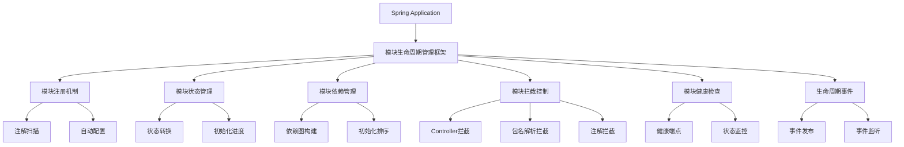
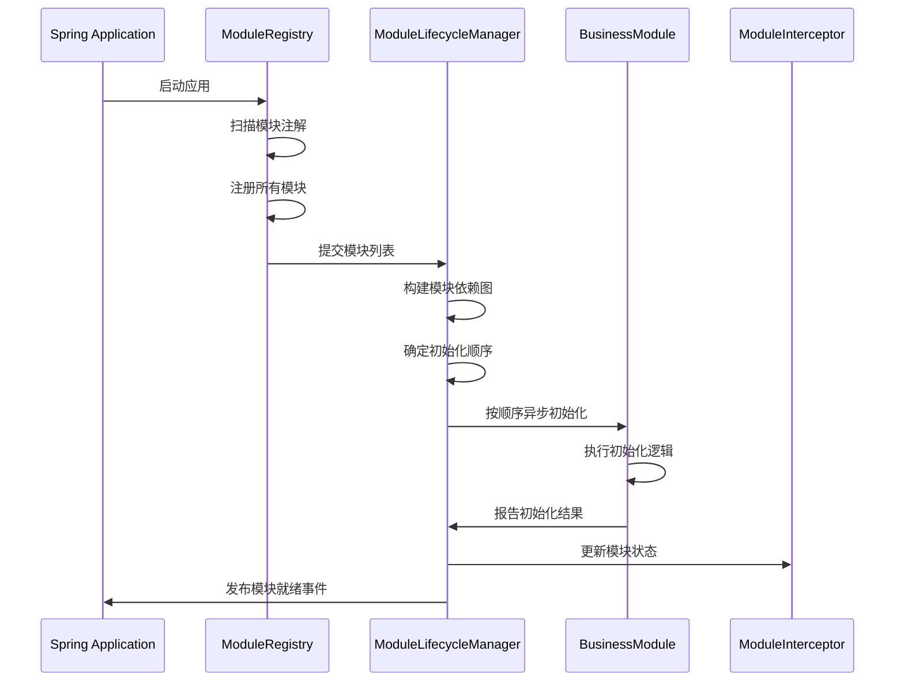
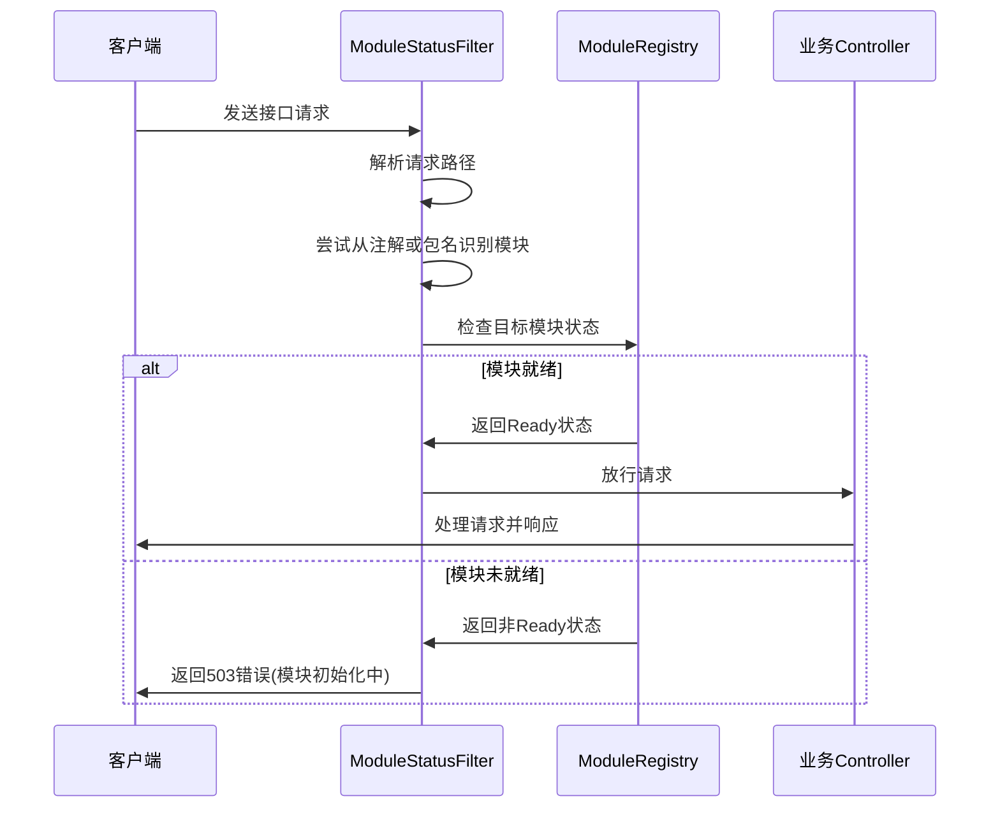
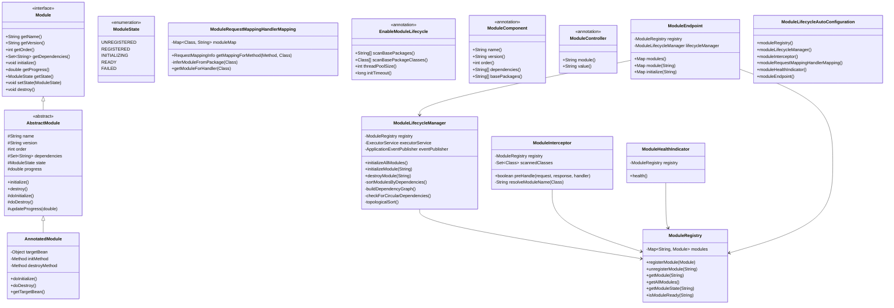

# Spring模块生命周期管理机制技术方案设计

## 1. 设计方案概述

为解决基于Spring Boot的Web工程中模块初始化与接口可用性不同步问题，设计一套模块生命周期管理机制，主要包含以下功能点：

- 模块注册与识别机制
- 模块初始化状态管理
- 模块依赖关系管理
- 模块接口拦截控制
- 模块健康检查与状态监控
- 模块生命周期事件通知

本方案基于Spring框架核心机制设计，风格与Spring源码保持一致，深度使用Spring Framework 6.2.4和Spring Boot 3.4.3的特性。

## 2. 核心概念

- **Module（模块）**：业务功能独立的代码单元，可以是一个或多个Spring组件的集合
- **ModuleLifecycle（模块生命周期）**：模块从注册、初始化到就绪的全过程
- **ModuleState（模块状态）**：模块当前状态，包括UNREGISTERED、REGISTERED、INITIALIZING、READY、FAILED等
- **ModuleDependency（模块依赖）**：模块间的依赖关系，决定初始化顺序
- **ModuleRegistry（模块注册中心）**：管理所有模块的注册信息
- **ModuleInterceptor（模块拦截器）**：拦截未就绪模块的接口调用

## 3. 架构设计

## 4. 核心流程

### 4.1 模块注册与初始化流程

### 4.2 接口请求拦截流程

## 5. 核心类设计

## 6. 关键组件说明

### 6.1 模块注解与配置

1. **@EnableModuleLifecycle**：启用模块生命周期管理，可配置扫描路径
2. **@ModuleComponent**：标识一个类为模块组件，包含名称、版本、优先级和依赖
3. **@ModuleController**：标识一个控制器属于特定模块，支持REST风格API
4. **ModuleLifecycleAutoConfiguration**：自动配置类，注册核心组件

### 6.2 模块状态管理

1. **ModuleState**：模块状态枚举，包含未注册、已注册、初始化中、就绪、失败等状态
2. **ModuleRegistry**：维护模块注册信息和状态
3. **ModuleLifecycleManager**：管理模块生命周期，控制初始化和销毁

### 6.3 接口拦截机制

1. **ModuleInterceptor**：拦截请求，检查目标模块状态
2. **ModuleRequestMappingHandlerMapping**：扩展Spring MVC的RequestMappingHandlerMapping，关联Controller与模块
3. **模块识别策略**：
    - 使用`@ModuleController`注解显式指定所属模块
    - 基于包命名约定自动推断模块（如`com.dbapp.business-a`对应`business-a`模块）
    - 基于`@ModuleComponent`注解的关系识别

### 6.4 健康检查与监控

1. **ModuleHealthIndicator**：实现Spring Boot Actuator的HealthIndicator接口，提供模块健康状态
2. **ModuleEndpoint**：自定义Actuator端点，提供模块详细信息和初始化进度

### 6.5 事件通知机制

1. **ModuleStateChangeEvent**：模块状态变更事件
2. **ModuleReadyEvent**：模块就绪事件
3. **ModuleFailedEvent**：模块初始化失败事件

## 7. 实现策略

1. 使用Spring的**BeanPostProcessor**机制识别模块组件
2. 利用**SmartInitializingSingleton**接口在所有单例Bean初始化后触发模块初始化
3. 基于**HandlerInterceptor**实现接口拦截
4. 使用**ApplicationEventPublisher**发布模块生命周期事件
5. 通过**CompletableFuture**提供异步并行初始化能力
6. 利用**Actuator**框架扩展健康检查和监控能力
7. 包名约定与注解相结合的模块识别机制，适应不同项目结构

## 8. 注意事项与限制

1. 模块间循环依赖将导致初始化失败
2. 异步初始化可能影响启动性能，需合理配置线程池
3. 模块拦截粒度取决于注解与扫描配置的准确性
4. 关键模块初始化失败需有完善的降级和恢复机制
5. 包名约定识别模块的方式要求项目结构符合预期，对于非标准结构项目需使用注解显式标识 