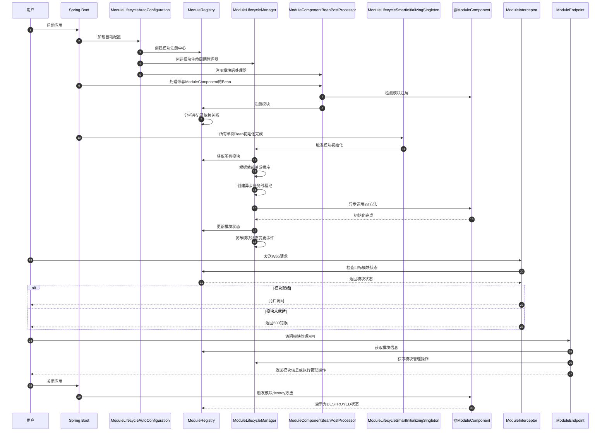
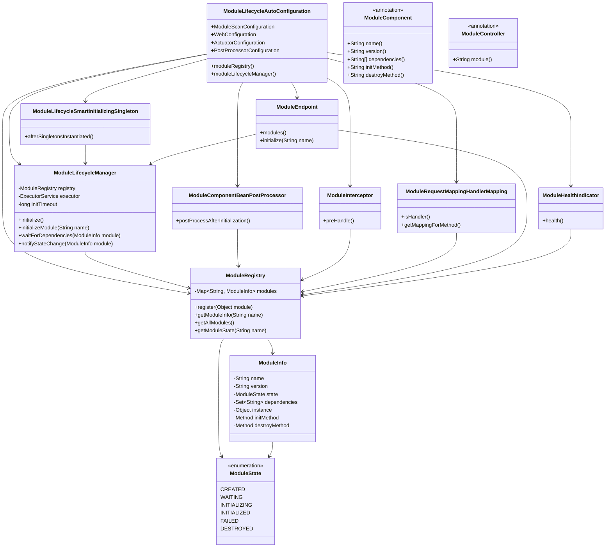

# Spring模块生命周期管理框架分析

## 1. 框架流程图

```mermaid
flowchart TD
%% 应用启动与配置加载
    START([应用启动]) --> SB[Spring Boot启动]
    SB --> AC[加载AutoConfiguration]
    AC --> MLC[ModuleLifecycleAutoConfiguration配置类加载]

    subgraph 配置与Bean初始化
        MLC --> MLP[ModuleLifecycleProperties属性加载]
        MLC --> MR[创建ModuleRegistry]
        MLC --> MLM[创建ModuleLifecycleManager]
        MLC --> MSC[ModuleScanConfiguration激活]
        MLC --> WC[WebConfiguration激活]
        MLC --> ACTC[ActuatorConfiguration激活]
        MLC --> PPC[PostProcessorConfiguration激活]
    end

%% 组件扫描与注册
subgraph 模块发现与注册
MSC --> SCAN[扫描@ModuleComponent注解的类]
SCAN --> MCBPP[ModuleComponentBeanPostProcessor处理]
MCBPP --> REG[注册模块到ModuleRegistry]
REG --> DEP[分析模块依赖关系]
end

%% 模块初始化
subgraph 模块生命周期管理
PPC --> MSIS[ModuleLifecycleSmartInitializingSingleton激活]
MSIS --> INIT[触发模块初始化]

INIT --> SORT[根据依赖关系排序模块]
SORT --> ASYNC[创建异步初始化任务]
ASYNC --> EXECUTE[执行初始化任务]

EXECUTE --> NOTIFY[发布模块状态变更事件]
EXECUTE --> STATUS[更新模块状态]
end

%% Web处理
subgraph Web请求处理
WC --> MI[创建ModuleInterceptor]
WC --> MRMHM[创建ModuleRequestMappingHandlerMapping]
MI --> INTERCEPT{拦截请求}
INTERCEPT -->|模块就绪|ALLOW[允许访问]
INTERCEPT -->|模块未就绪|REJECT[拒绝访问]

MRMHM --> MC[扫描@ModuleController]
MC --> MAP[处理请求映射]
end

%% 监控与管理
subgraph 监控与健康检查
ACTC --> MHI[创建ModuleHealthIndicator]
ACTC --> ME[创建ModuleEndpoint]
MHI --> HEALTH[提供模块健康信息]
ME --> API[暴露模块管理API]
end

%% 模块状态流转
subgraph 模块状态流转
REG --> CREATED[模块状态: CREATED]
INIT --> INITIALIZING[模块状态: INITIALIZING]
EXECUTE -->|成功| INITIALIZED[模块状态: INITIALIZED]
EXECUTE -->|失败|FAILED[模块状态: FAILED]
EXECUTE -->|依赖未就绪|WAITING[模块状态: WAITING]
end

%% 模块销毁流程
subgraph 模块销毁流程
SHUTDOWN([应用关闭]) --> DESTROY[触发模块销毁]
DESTROY --> DS[模块状态: DESTROYED]
end

%% 业务模块示例
subgraph 示例模块关系
CM[CoreModule]
BAM[BusinessAModule]
BBM[BusinessBModule]
CM <-- 依赖 --- BAM
CM <-- 依赖 --- BBM
BAM <-- 依赖 --- BBM
end

%% 用户请求流程
subgraph 用户请求处理
REQ[用户API请求] --> ENDPOINT[匹配Controller端点]
ENDPOINT --> CHECK{模块就绪检查}
CHECK -->|就绪|PROCESS[处理请求]
CHECK -->| 未就绪|ERROR[返回503错误]
end
```

## 2. 时序图



## 3. 类图



## 4. 项目理解与阅读指南

### 4.1 如何理解和阅读Spring模块生命周期管理框架

要系统地理解这个项目的作用过程和加载过程，建议按照以下步骤进行：

#### 从核心配置类入手

首先查看自动配置类：

- `ModuleLifecycleAutoConfiguration` - 框架的核心配置类
- `ModuleLifecycleProperties` - 配置属性类

这些类展示了框架的整体架构和可配置选项。

#### 理解模块管理核心

接下来研究核心组件：

- `ModuleRegistry` - 模块注册中心
- `ModuleLifecycleManager` - 模块生命周期管理器
- `@ModuleComponent` - 模块组件注解

这些类定义了模块的注册、状态管理和生命周期控制。

#### 分析启动流程

框架的启动流程：

1. Spring Boot启动，加载`ModuleLifecycleAutoConfiguration`
2. 扫描`@ModuleComponent`注解的类，注册到`ModuleRegistry`
3. `ModuleComponentBeanPostProcessor`处理模块组件
4. `ModuleLifecycleSmartInitializingSingleton`在所有单例Bean初始化后触发模块初始化
5. 根据依赖关系，有序初始化各模块

#### 研究Web集成

Web相关组件：

- `ModuleInterceptor` - 拦截未就绪模块的请求
- `ModuleRequestMappingHandlerMapping` - 处理模块控制器的请求映射
- `@ModuleController` - 模块控制器注解

#### 了解监控与管理

监控与管理组件：

- `ModuleHealthIndicator` - 提供模块健康状况
- `ModuleEndpoint` - 暴露模块管理API

#### 通过实例学习

示例项目包含：

- `CoreModule` - 核心模块
- `BusinessAModule` 和 `BusinessBModule` - 业务模块
- 对应的控制器类

通过这些实例可以了解模块的创建、依赖关系和初始化流程。

#### 依赖关系与初始化顺序

重点关注：

- 模块如何声明依赖关系
- 框架如何检测依赖并排序初始化
- 异步初始化与状态管理的实现

#### 事件机制

研究：

- 模块状态变更事件
- 初始化完成通知
- 事件监听机制

### 4.2 ModuleLifecycleAutoConfiguration工作原理分析

`ModuleLifecycleAutoConfiguration`是Spring模块生命周期管理框架的核心自动配置类，它通过Spring
Boot的自动配置机制自动装配和启动整个模块框架。以下是它的工作原理：

#### 自动配置触发机制

- 使用`@AutoConfiguration`注解标记，使Spring Boot能自动发现并应用此配置
- 通过Spring Boot的自动配置机制（通过`spring.factories`或Spring Boot 3的新机制）被加载

#### 核心配置结构

`ModuleLifecycleAutoConfiguration`由多个内部类组成，每个负责特定功能区域：

##### 基础Bean配置

```java

@Bean
public ModuleRegistry moduleRegistry() { ...}

@Bean
public ModuleLifecycleManager moduleLifecycleManager(...) { ...}
```

##### 模块扫描配置

```java

@Configuration
@ComponentScan(basePackages = {"${module.lifecycle.scan-base-packages:}", "${module.lifecycle.scan-base-package-classes:}"},
        includeFilters = @ComponentScan.Filter(ModuleComponent.class))
public static class ModuleScanConfiguration { ...
}
```

##### Web相关配置

```java

@Configuration
@ConditionalOnWebApplication
public static class WebConfiguration { ...
}
```

##### Actuator监控配置

```java

@Configuration
@ConditionalOnClass(HealthIndicator.class)
public static class ActuatorConfiguration { ...
}
```

##### 后处理器配置

```java

@Configuration
public static class PostProcessorConfiguration { ...
}
```

#### 属性配置绑定

- 使用`@EnableConfigurationProperties(ModuleLifecycleProperties.class)`将配置文件中的属性绑定到对应类
- 配置项可在`application.yml`中自定义，如线程池大小、初始化超时时间等

#### 条件化配置

- 使用条件注解控制配置加载，例如：
    - `@ConditionalOnWebApplication`：只在Web应用中加载Web相关配置
    - `@ConditionalOnClass`：只在特定类存在时加载对应配置
    - `@ConditionalOnMissingBean`：只在没有特定Bean时创建默认实现

#### 核心工作流程

1. **模块发现**：扫描并注册带有`@ModuleComponent`注解的类
2. **模块依赖分析**：通过`ModuleRegistry`管理模块间依赖关系
3. **生命周期管理**：
    - `ModuleComponentBeanPostProcessor`处理模块组件的创建
    - `ModuleLifecycleSmartInitializingSingleton`在所有单例Bean初始化后触发模块初始化
4. **Web控制**：
    - `ModuleInterceptor`拦截未就绪模块的请求
    - `ModuleRequestMappingHandlerMapping`处理模块控制器的请求映射
